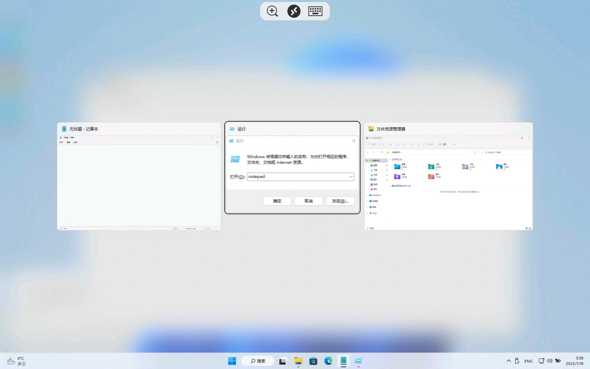

# MiuiPadMeta

为MIUI和HyperOS设备恢复键盘Meta/Win键功能（禁用掉小米的快捷键），同时禁用Alt-Tab快捷键。这样就可以在远程桌面里用Meta键和Alt-Tab了。适配小米平板5系列以及Android12+的MIUI手机。
Restore Meta/Win key function on MIUI devices(disable Xiaomi hotkeys), and disable Alt-Tab hotkey. Allows you to use Meta and Alt-Tab key in Remote Desktop。Adapted for Xiaomi Pad 5 Series and MIUI phones with Android12+.

### 系统版本支持情况 OS version support

| 系统版本           | 恢复Meta键 | 禁用Alt-Tab |
| ------------------ | ---------- | ----------- |
| MIUI12.5 Android11 | ? *        | ?           |
| MIUI13 Android11   | √ **       | √           |
| MIUI13 Android12   | √          | √           |
| MIUI14 Android13   | √          | √           |
| HyperOS            | √? ****    | √? ***      |

√ 表示经过测试，目前支持

? 表示没有经过测试，可能支持

× 表示经过测试，目前不支持

> *Android11上仅支持小米平板5系列，不支持MIUI手机
>
> **MIUI for Pad Android11: PC模式下的快捷键依旧可用，PC模式的快捷键是另一套逻辑实现，请退出PC模式
>
> ***禁用Alt-Tab理论上在所有Android系统上支持。
>
> **** 小米在HyperOS加强了对Bootloader权限的管控，我暂未将我的Xiaomi Pad 5 Pro设备更新到HyperOS，所以无法测试。
>
> [DisableAltTab](https://modules.lsposed.org/module/pub.chara.disablealttab) 模块为独立出来的禁用Alt-Tab功能，适配所有Android设备。

### 截图 Screenshot

### 实现方法 Implementation detail

### 鸣谢 Special thanks

### 第三方开源引用 Open Source License

See [MiuiPadMeta](https://github.com/CwithW/MiuiPadMeta)